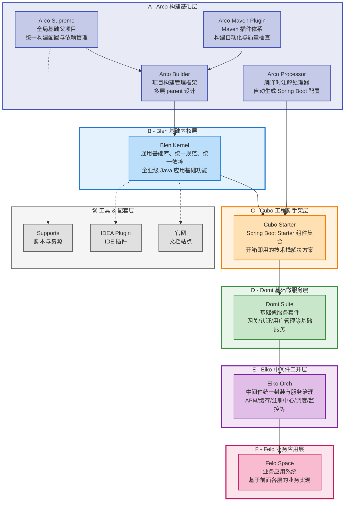

# Zeka Stack

<div align="center">

**一个现代化的 Java 微服务工程体系**

Zeka（音近"智核"）是一套完整的企业级微服务开发生态，提供从基础内核到业务中台的全栈解决方案。

</div>

---

## 📖 项目简介

Zeka Stack 是一个企业级 Java 微服务工程体系的生态总仓库，通过统一的技术栈、规范和工具链，帮助开发团队快速构建高质量的微服务应用。

### 命名理念

- **Zeka**: 自造词，音近"智核"，个性强、易注册品牌
- **Blen**: Blend（混合、集成），适合工具模块或桥接模块
- **Arco**: Architecture + Core，适合架构主模块
- **Cubo**: Cube 的变体，结构性强，可用于通用工具模块
- **Domi**: Domain + Microservice，表示「领域微服务集合」
- **Eiko**: 音似 eco（生态），也像 Infrastructure Kernel Orchestration 的缩写，具有技术基座感
- **Felo**: Framework + Logic，可爱、亲切，有现代感

---

## 🏗️ 整体架构

Zeka Stack 采用分层架构设计，从底层基础设施到顶层业务应用，提供完整的技术栈支持：



---

## 📦 核心模块

### 0️⃣ Arco 构建基础层 - 构建体系

**定位**：Zeka Stack 的构建基础层，提供统一的构建配置、依赖管理、编译时增强和构建自动化能力。作为所有项目的最底层基础，确保整个生态的构建一致性。

**核心模块**：

| 模块                  | 说明                                                                                                           |
|---------------------|--------------------------------------------------------------------------------------------------------------|
| `arco-supreme`      | **全局基础父项目**：所有项目的最顶层父项目，统一管理构建配置、依赖版本、编码规范、插件版本等全局配置                                                         |
| `arco-builder`      | **项目构建管理框架**：基于 Maven 的多层 parent 设计，为业务型和组件型项目提供统一的构建配置和依赖管理，继承自 arco-supreme                                |
| `arco-processor`    | **编译时注解处理器**：自动生成 Spring Boot 的自动配置文件（spring.factories、AutoConfiguration.imports）和 Java SPI 服务配置文件，支持 AOT 编译 |
| `arco-maven-plugin` | **Maven 插件体系**：提供完整的 Maven 插件集合，包括构建自动化、代码质量检查、一键部署、容器化、启动脚本生成等功能                                            |

**核心价值**：

- **统一构建规范**：通过 arco-supreme 和 arco-builder 确保所有项目使用相同的构建配置
- **自动化优先**：arco-maven-plugin 践行"90秒自动化"理念，将重复性任务自动化
- **编译时增强**：arco-processor 在编译阶段自动生成配置，减少手动维护成本
- **约定大于配置**：提供开箱即用的默认配置，支持按需覆盖

**一句话概括**：Arco 层 = Zeka Stack 的「构建基础设施」，为整个生态提供统一的构建底座。

---

### 1️⃣ Blen Kernel - 基础内核库

**定位**：通用基础能力 & 编码规范内核，是整个栈里其他项目可以共同依赖的基础层。

**核心模块**：

| 模块                         | 说明                         |
|----------------------------|----------------------------|
| `blen-kernel-common`       | 通用工具类、基础模型、统一异常、统一返回结构等    |
| `blen-kernel-dependencies` | 依赖管理 / BOM，统一整个生态的依赖版本     |
| `blen-kernel-web`          | Web 层基础封装：统一异常处理、统一响应、拦截器等 |
| `blen-kernel-auth`         | 认证 / 鉴权基础能力封装              |
| `blen-kernel-validation`   | 参数校验扩展、统一校验注解和错误处理         |
| `blen-kernel-tracer`       | 链路追踪、日志上下文等能力              |
| `blen-kernel-notify`       | 通知相关的通用接口封装（邮件、短信、站内信等）    |
| `blen-kernel-test`         | 测试支持模块：测试基类、测试工具、集成测试封装    |
| `blen-kernel-spi`          | SPI 扩展点定义，实现组件间可插拔         |
| `blen-kernel-extend`       | 对特定框架 / 业务场景的扩展实现          |
| `blen-kernel-generator`    | 代码生成相关基础支持                 |

**一句话概括**：Blen Kernel = Zeka Stack 的「语言级基础设施」。

---

### 2️⃣ Cubo Starter - Starter 套件

**定位**：围绕 Spring Boot 的一整套 Starter 与工程脚手架，解决「一个项目应该如何规范地起步」的问题。

**核心模块**：

| 模块                           | 说明                                |
|------------------------------|-----------------------------------|
| `cubo-boot-dependencies`     | 整个 Cubo 体系的依赖管理/BOM               |
| `cubo-launcher-spring-boot`  | 应用启动器：统一启动入口、环境装配、基础配置            |
| `cubo-rest-spring-boot`      | REST API 相关封装：统一的 REST 风格约束、控制层规范 |
| `cubo-mybatis-spring-boot`   | 数据访问层集成：MyBatis/MyBatis-Plus 规范封装 |
| `cubo-logsystem-spring-boot` | 日志体系封装：结构化日志、链路日志、日志标准化           |
| `cubo-openapi-spring-boot`   | OpenAPI/Swagger 相关集成与统一配置         |
| `cubo-messaging-spring-boot` | 消息中间件集成（Kafka/RocketMQ 等）的抽象与自动装配 |
| `cubo-dict-spring-boot`      | 数据字典相关封装                          |
| `cubo-endpoint-spring-boot`  | 运维端点支持（健康检查、指标暴露、自定义端点等）          |
| `cubo-combiner-spring-boot`  | 多能力组合封装，把多个 starter 组合成标准应用模版     |
| `templates/`                 | 项目模板，用于一键生成标准化工程骨架                |

**一句话概括**：Cubo Starter 帮你定义「一套符合 Zeka 栈规范的 Spring Boot 应用长什么样」。

---

### 3️⃣ Cubo Starter Examples - 示例项目集

**定位**：基于 cubo-starter 的示例工程集合，用于展示和验证各 Starter 的组合使用方式。

**主要内容**：

- `cubo-rest-spring-boot-sample` - REST API 示例
- `cubo-mybatis-spring-boot-sample` - MyBatis 集成示例
- `cubo-logsystem-spring-boot-sample` - 日志系统示例
- `cubo-openapi-spring-boot-sample` - OpenAPI 文档示例
- `cubo-messaging-spring-boot-sample` - 消息中间件示例
- `cubo-endpoint-spring-boot-sample` - 运维端点示例
- `cubo-launcher-spring-boot-sample` - 应用启动器示例

---

### 4️⃣ Domi Suite - 基础微服务套件

**定位**：面向常见业务场景的可复用微服务套件，抽象「一套公司级中台」。

**核心模块**：

| 模块                  | 说明                              |
|---------------------|---------------------------------|
| `domi-auth`         | 认证服务（登录、Token、权限等）              |
| `domi-channel`      | 渠道 / 通道服务（对外通道路由、第三方平台接入等）      |
| `domi-gateway`      | API 网关（完整版）                     |
| `domi-gateway-lite` | API 网关（轻量版）                     |
| `domi-logcat`       | 日志中心 / 审计日志服务                   |
| `domi-uid`          | 分布式唯一 ID 生成服务                   |
| `domi-ums`          | 用户管理服务（User Management Service） |

**核心价值**：把「一个标准中台」拆解成多服务并组件化输出。

---

### 5️⃣ Eiko Orch - 中间件编排

**定位**：对常见基础设施组件（APM、缓存、注册中心、调度、限流等）的统一封装与编排。

**核心模块**：

| 模块              | 说明                                  |
|-----------------|-------------------------------------|
| `eiko-apm`      | 应用性能监控（如 SkyWalking 等）的集成与封装        |
| `eiko-jetcache` | JetCache 相关的统一封装（缓存策略、配置、监控等）       |
| `eiko-nacos`    | Nacos 注册中心 / 配置中心的统一封装              |
| `eiko-schedule` | 分布式任务调度相关封装（可结合 xxl-job / Quartz 等） |
| `eiko-sentinel` | Sentinel 流量控制、熔断降级等能力封装             |

**核心价值**：把分散的中间件接入，变成一套统一编排的组件体系。

---

### 6️⃣ Felo Space - 业务应用系统

**定位**：一个基于 Zeka Stack 的电商/交易类示例业务空间，用于演示工程体系在真实业务中的落地。

**核心模块**：

| 模块          | 说明              |
|-------------|-----------------|
| `felo-mall` | 商城类业务示例（商品、订单等） |
| `felo-pay`  | 支付 / 结算类业务示例    |

**核心价值**：演示如何使用 Zeka Stack 快速搭建一套完整业务系统。

---

### 7️⃣ Supports - 支撑资源与工程脚本

**定位**：集中存放各种辅助资源与工程化脚本。

**主要内容**：

| 目录/文件      | 说明                               |
|------------|----------------------------------|
| `icons/`   | 图标资源（用于官网、文档、插件等）                |
| `maven/`   | Maven 相关配置（settings.xml、仓库镜像配置等） |
| `scripts/` | 各类 Shell / Python / Makefile 脚本  |
| `prompts/` | 面向 AI/文档生成的提示词等内容                |
| `makefile` | 顶层构建入口，提供统一命令入口                  |

**核心价值**：整个生态的「工具箱 / 运维箱」。

---

### 8️⃣ Zeka IDEA Plugin - IntelliJ 插件

**定位**：面向 IntelliJ IDEA 的插件工程，提供工程模板、智能文档、配置联动等功能。

**核心模块**：

| 模块                    | 说明                      |
|-----------------------|-------------------------|
| `intelli-ai-engine`   | AI 引擎接入层（封装各种模型调用）      |
| `intelli-ai-javadoc`  | 基于 AI 的 JavaDoc 生成与文档辅助 |
| `intelli-ai-nacos`    | 与 Nacos 配置/服务的联动能力      |
| `intelli-ai-tracer`   | 跟踪 / Trace 相关联动能力       |
| `archiver-man`        | 工程/代码整理相关工具             |
| `uniform-format`      | 统一代码格式化工具               |
| `template-with-ai`    | 带 AI 的项目模板              |
| `template-without-ai` | 不带 AI 的项目模板             |

**核心价值**：配套 Zeka Stack 的 IDE 一体化支持，提升开发效率。

---

### 9️⃣ Zeka Stack 官网 - 文档站点

**定位**：Zeka Stack 的文档 & 官网仓库，作为整个生态的「对外门面」。

**主要内容**：

- `docs/` - 文档内容（静态站点源码）
- `start` - 快速启动脚本
- `sync_docs.py` - 从各个仓库同步文档到官网的脚本

---

## 🚀 快速上手

### 前置要求

- **Git**: 2.13+ (需要支持子模块)
- **JDK**: 17+
- **Maven**: 3.8+ (或使用项目自带的 Maven Wrapper)

### 克隆项目

使用以下命令克隆 Zeka Stack 及其所有子项目：

```bash
# 克隆主仓库及所有子模块
git clone --recurse-submodules git@github.com:zeka-stack/zeka-stack.git

# 进入项目目录
cd zeka-stack
```

如果你已经克隆了主仓库，但没有初始化子模块，可以使用：

```bash
# 初始化并拉取所有子模块
git submodule update --init --recursive
```

### 更新项目

当你需要更新整个项目（包括所有子模块）时：

```bash
# 拉取最新代码
git pull

# 更新所有子模块
git submodule update --init --recursive
```

**💡 小技巧**：如果想让 `git pull` 自动更新子模块，可以设置：

```bash
git config submodule.recurse true
```

### 构建项目

使用 Maven Wrapper 构建整个项目（无需本地安装 Maven）：

```bash
# 编译整个项目
./mvnw clean install

# 跳过测试快速构建
./mvnw clean install -DskipTests

# 只编译特定模块（以 blen-kernel 为例）
./mvnw clean install -pl blen-kernel -am
```

### 运行示例

**方式一：运行 Cubo Starter 示例**

```bash
# 进入示例项目目录
cd cubo-starter-examples/cubo-rest-spring-boot-sample

# 启动示例应用
../../mvnw spring-boot:run
```

**方式二：运行 Felo Space 业务示例**

```bash
# 进入业务示例目录
cd felo-space/felo-mall

# 启动商城示例
../../mvnw spring-boot:run
```

### IDE 配置

**IntelliJ IDEA 推荐配置**：

1. 安装 Zeka IDEA Plugin（可选，提升开发体验）
2. 导入项目时选择 "Open as Maven Project"
3. 配置 JDK 17+
4. 启用 Annotation Processor：
    - Settings → Build, Execution, Deployment → Compiler → Annotation Processors
    - 勾选 "Enable annotation processing"

---

## 📚 文档

- **官方文档**: [https://zeka-stack.github.io](https://zeka-stack.github.io)
- **快速开始**: [Getting Started Guide](https://zeka-stack.github.io/docs/getting-started)
- **API 文档**: [API Reference](https://zeka-stack.github.io/docs/api)
- **最佳实践**: [Best Practices](https://zeka-stack.github.io/docs/best-practices)

---

## 🛠️ 开发指南

### 代码规范

项目采用统一的代码规范，相关配置文件位于 `supports/` 目录。

**检查代码注释版本号**：

```bash
# 找出不是 @since 1.0.0 的版本号
@since\s+(?!1\.0\.0)\d+\.\d+\.\d+

# 找出不是 @version 1.0.0 的版本号
@version\s+(?!1\.0\.0)\d+\.\d+\.\d+
```

### 分支管理

- `main` - 主分支，稳定版本
- `develop` - 开发分支
- `feature/*` - 功能分支
- `hotfix/*` - 紧急修复分支

### 提交规范

采用 [Conventional Commits](https://www.conventionalcommits.org/) 规范：

```
<type>(<scope>): <subject>

<body>

<footer>
```

类型（type）：

- `feat`: 新功能
- `fix`: 修复 bug
- `docs`: 文档更新
- `style`: 代码格式调整
- `refactor`: 重构
- `test`: 测试相关
- `chore`: 构建/工具链相关

---

## 🗺️ Roadmap

### 当前版本 (v1.0.0)

- [x] 基础内核库完善
- [x] Spring Boot Starter 套件
- [x] 业务中台基础服务
- [x] IDEA 插件基础功能

### 近期计划 (v1.1.0)

- [ ] 完善各模块文档
- [ ] 增加更多示例项目
- [ ] 性能优化与监控增强
- [ ] 云原生支持（K8s、Docker）

### 远期规划 (v2.0.0)

- [ ] 支持多语言客户端（Go、Python、Node.js）
- [ ] 低代码平台集成
- [ ] AI 辅助开发能力增强
- [ ] 完整的 DevOps 工具链

---

## 🤝 贡献

我们欢迎各种形式的贡献！

### 贡献方式

1. Fork 本仓库
2. 创建特性分支 (`git checkout -b feature/AmazingFeature`)
3. 提交更改 (`git commit -m 'feat: add some AmazingFeature'`)
4. 推送到分支 (`git push origin feature/AmazingFeature`)
5. 提交 Pull Request

### 开发者社区

- 💬 [GitHub Discussions](https://github.com/zeka-stack/zeka-stack/discussions) - 讨论与交流
- 🐛 [Issue Tracker](https://github.com/zeka-stack/zeka-stack/issues) - 问题反馈
- 📧 Email: support@zeka-stack.io

---

## 📄 License

本项目采用 [Apache License 2.0](LICENSE) 开源协议。

---

## 🙏 致谢

感谢所有为 Zeka Stack 做出贡献的开发者！

特别感谢以下开源项目的启发：

- Spring Boot
- Apache Dubbo
- Alibaba Nacos
- MyBatis-Plus

---

<div align="center">

**Made with ❤️ by Zeka Stack Team**

[官网](https://zeka-stack.github.io) · [文档](https://zeka-stack.github.io/docs) · [示例](https://github.com/zeka-stack/cubo-starter-examples)

</div>
